<h1>Homepage Hero Section</h1>
<div>
    Once you navigate to the homepage you can press Login button which will open Clerk authentication form or you can simply 'Explore now' button which will scroll the page to the events section where you can find all types of events according to you interests    
</div>
<br/>
<a href='https://next-event-andrey-tuguchev.vercel.app/' target="_blank" >
        
</a><br/><br/><br/>


<h2>Homepage Events Section</h2>
<div>
You can easily search by title or by category and find the event that will start soon. <br/>
Pagination appears only if we have more than 9 events to display according to your current search queries.
</div>
<br/>
<a href='#' target="_blank" >
        
</a><br/><br/><br/>


<h2>Homepage Search</h2>
<div>
You can easily search for any text in the event's title or search by category
</div>
<br/>
<a href='#' target="_blank" >
        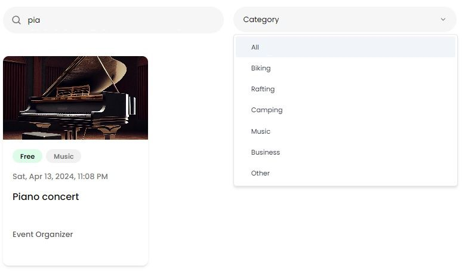
</a><br/><br/><br/>


<h2>Pagination</h2>
<div>
Pagination will be rendered if we have more than 9 events to display according to your current search request.
</div>
<br/>
<a href='#' target="_blank" >
        
</a><br/><br/><br/>


<h2>Event Page Hero Section</h2>
<div>
Once you navigate to an existing event you can see all the information about this event in it's Hero section. <br/>
By pressing the 'Get Tickets' button you will be redirected to the Stripe payment form where you can use <br/>the test credit card number
<code>4242 4242 4242 4242</code> and any expiration date and CVV in order to finalize your purchase.
</div>
<br/>
<a href='#' target="_blank" >
        
</a><br/><br/><br/>


<h2>Related Events</h2>
<div>
If we have any other events from the same category they will be listed below the related events section for currently opened event.
</div>
<br/>
<a href='#' target="_blank" >
        
</a><br/><br/><br/>


<h2>Sign-In Form</h2>
<div>
Once you click 'Login' or 'Get Tickets' button you'll be redirected to the sign-in page where you can find Clerk based authentication. You can use Google, Facebook, LinkedIn or even GitHub accounts to sign-in or sign-up via Clerk.
</div>
<br/>
<a href='#' target="_blank" >
        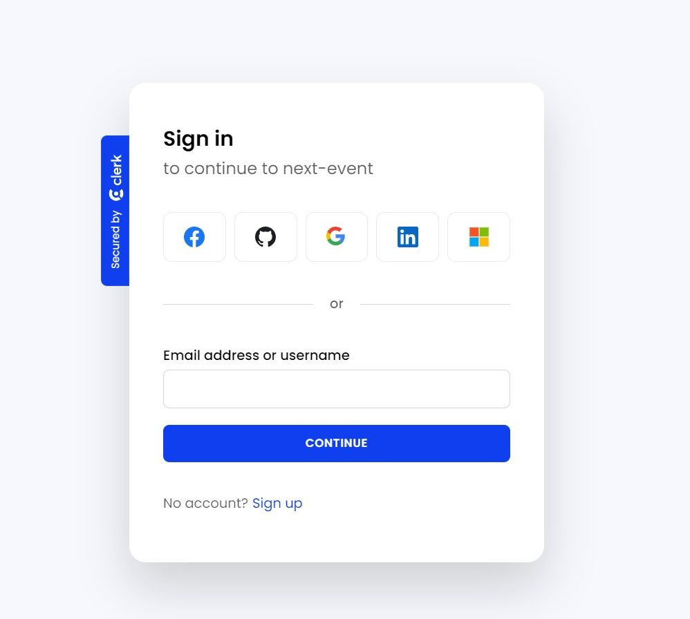
</a><br/><br/><br/>


<h2>Stripe Payment Form</h2>
<div>
Once you've pressed 'Get Tickets' button you'll be redirected to the Stripe payment form where you can enter test credit card details to complete this purchase.
</div>
<br/>
<a href='#' target="_blank" >
        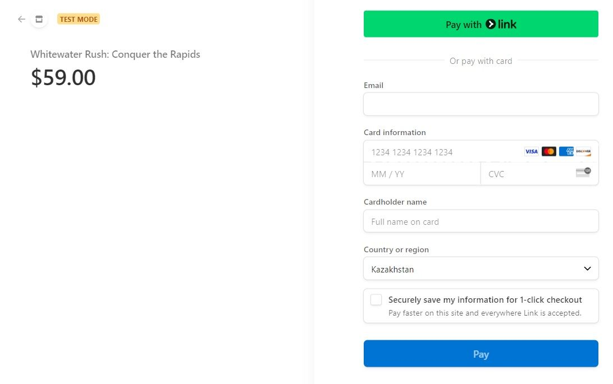
</a><br/><br/><br/>


<h2>Profile My Tickets</h2>
<div>
If you've purchased any ticket in the past those tickets will be listed at your profile's page.
</div>
<br/>
<a href='#' target="_blank" >
        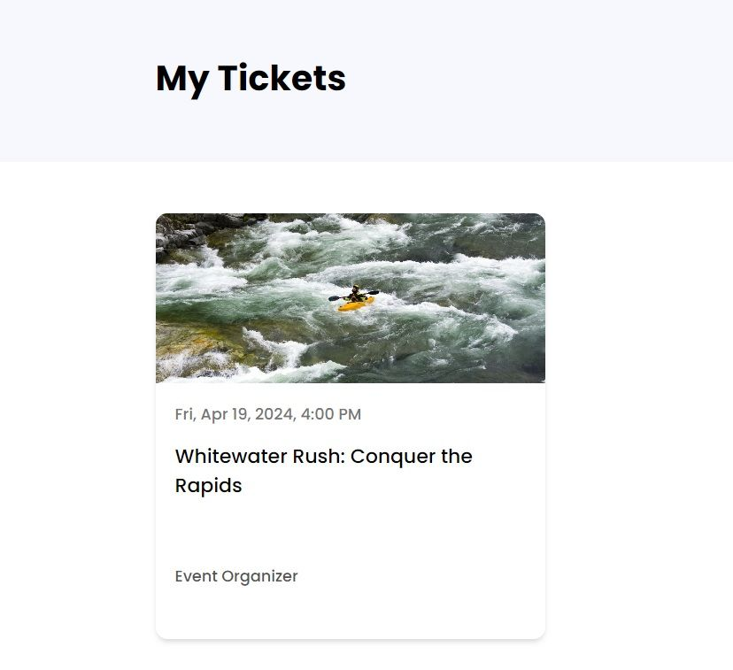
</a><br/><br/><br/>


<h2>Profile Organized Events</h2>
<div>
If you've organized any event in the past those events will be listed at your profile's page.
</div>
<br/>
<a href='#' target="_blank" >
        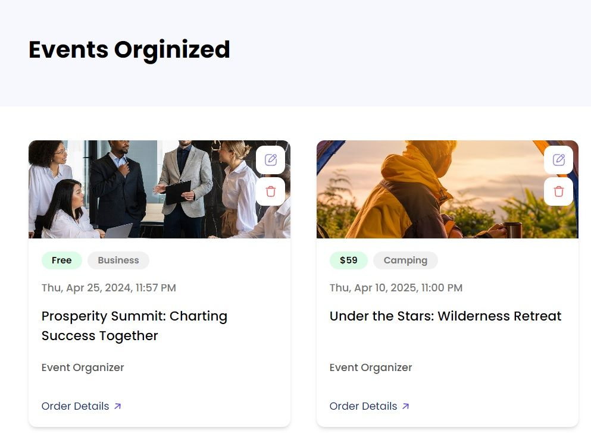
</a><br/><br/><br/>


<h2>New Event Status</h2>
<div>
Every new event has 'Pending Approval' status by default and only the website's admin can approve the event. Each user can only have 2 pending events at any point in time and the user can create up to 25 events. Create form will not be rendered if the user already has 2 pending events or reached 25 events created in total. This can help us to reduce the amount of spam.
</div>
<br/>
<a href='#' target="_blank" >
        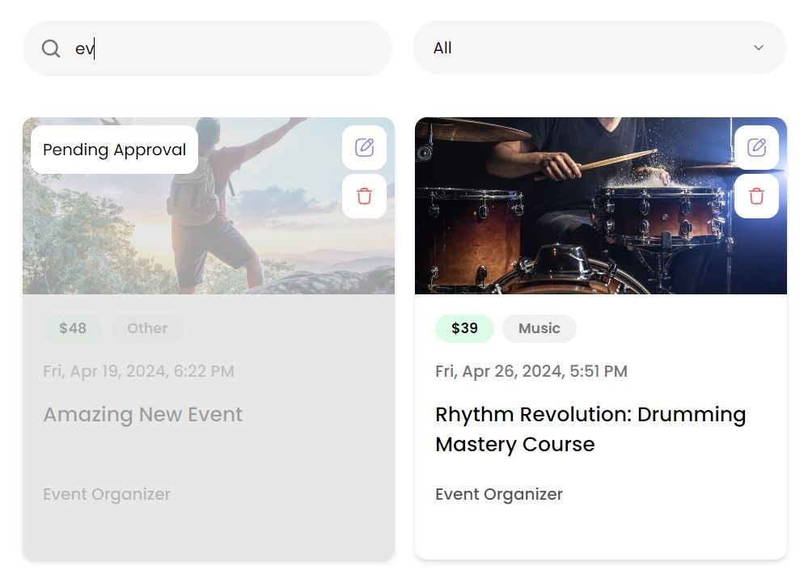
</a><br/><br/><br/>


<h2>Event Delete Action</h2>
<div>
Once you navigate to your profile page you can edit or delete your events by pressing specified buttons. Edit button will navigate you to the event edit form but the delete button will render the confirmation where you can make a final decision about this event.
</div>
<br/>
<a href='#' target="_blank" >
        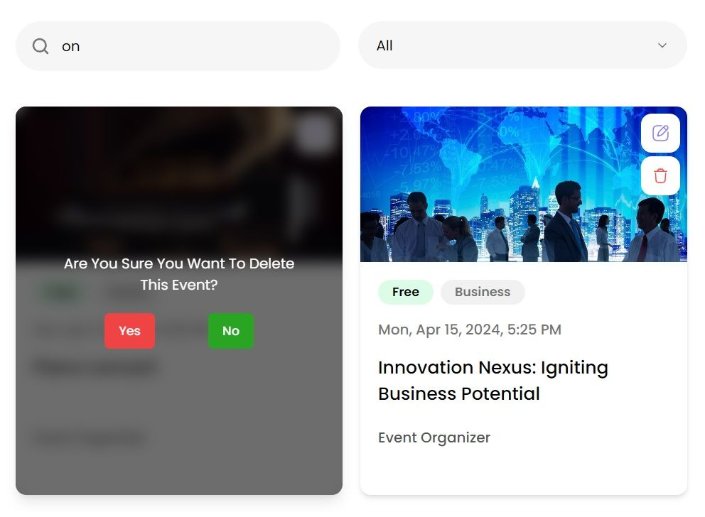
</a><br/><br/><br/>


---

# Installation guide:

This is a [Next.js](https://nextjs.org/) project bootstrapped with [`create-next-app`](https://github.com/vercel/next.js/tree/canary/packages/create-next-app).

## Getting Started

First, run the development server:

```bash
npm run dev
# or
yarn dev
# or
pnpm dev
# or
bun dev
```

Open [http://localhost:3000](http://localhost:3000) with your browser to see the result.

You can start editing the page by modifying `app/page.tsx`. The page auto-updates as you edit the file.

This project uses [`next/font`](https://nextjs.org/docs/basic-features/font-optimization) to automatically optimize and load Inter, a custom Google Font.

## Learn More

To learn more about Next.js, take a look at the following resources:

- [Next.js Documentation](https://nextjs.org/docs) - learn about Next.js features and API.
- [Learn Next.js](https://nextjs.org/learn) - an interactive Next.js tutorial.

You can check out [the Next.js GitHub repository](https://github.com/vercel/next.js/) - your feedback and contributions are welcome!

## Deploy on Vercel

The easiest way to deploy your Next.js app is to use the [Vercel Platform](https://vercel.com/new?utm_medium=default-template&filter=next.js&utm_source=create-next-app&utm_campaign=create-next-app-readme) from the creators of Next.js.

Check out our [Next.js deployment documentation](https://nextjs.org/docs/deployment) for more details.


==================================
==================================

## Deploy on AWS EC2
**#1 Create AWS EC2 free tier instance (I'm using Ubuntu 22.04 LTS).**

**#2 Enable incoming traffic via port 80 and 443 via AWS account manager during EC2 creation process**
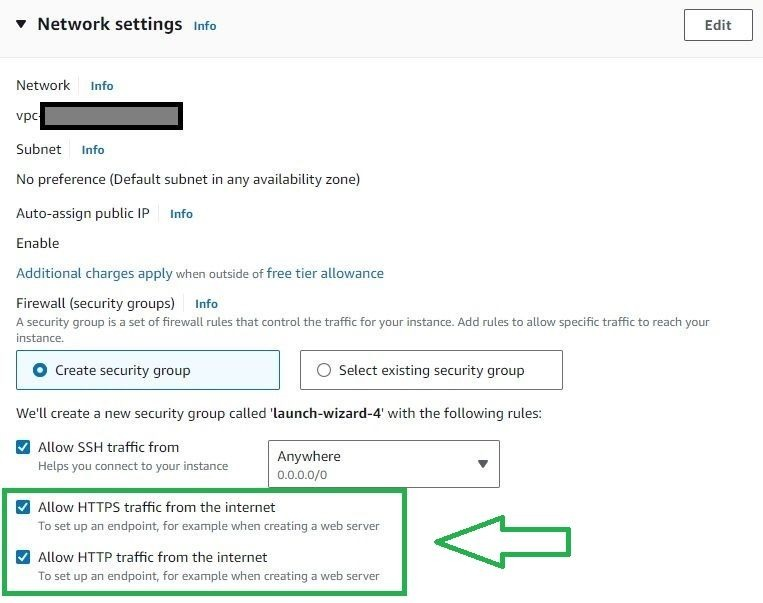

**#3.0 check current RAM and SWAP file using command:**
```bash
htop
```
if SWAP is 0 then you need to create it. This will reduce the CPU load for the data when RAM is full because when an instance runs out of RAM linux will try to write data into SWAP but you don't have one and it will constantly try to do it again and again... It will cause a huge CPU overload...

**Example of NOT configured SWAP file in the system:**
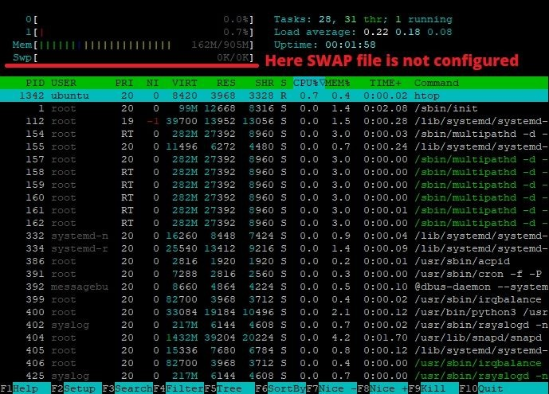

**#3.1 Create SWAP file which is 2-3 times bigger than your RAM using this command set for Ubuntu Server:**
```bash
sudo fallocate -l 4G /swapfile; sudo chmod 600 /swapfile; sudo mkswap /swapfile; sudo swapon /swapfile; free -h; sudo cp /etc/fstab /etc/fstab.bak; echo '/swapfile none swap sw 0 0' | sudo tee -a /etc/fstab; sudo sysctl vm.swappiness=10;
```


**#4 Login to AWS EC2 terminal using SSH and enter these commands to install Nginx web server:**
```bash
sudo apt update
```
```bash
sudo apt install nginx
```

**NOTE: replace your_domain with your actual domain name.**

**#5 Create directory for *your_domain* (replace it with your real domain name) as follows:**
```bash
sudo mkdir -p /var/www/your_domain/html
```


**#6 Next, assign ownership of the directory with the `$USER` environment variable:**
```bash
sudo chown -R $USER:$USER /var/www/your_domain/html
```

**#7 Set permissions on this directory:**
```bash
sudo chmod -R 755 /var/www/your_domain
```

**#8 In order for Nginx to serve this content, it’s necessary to create a server block with the correct directives.**
Instead of modifying the default configuration file directly, let’s make a new one at **/etc/nginx/sites-available/your_domain**:\
```bash
sudo nano /etc/nginx/sites-available/your_domain
```

**#9 Copy this Nginx config example, replace YOUR_DOMAIN with the actual domain name for your website and paste the following configuration block into the terminal where nano text editor is opened from the previous command:**
```bash
server {

    # listen on *:443 -> ssl; instead of *:80

    server_name YOUR_DOMAIN.com www.YOUR_DOMAIN.com;

    gzip on;
    gzip_proxied any;
    gzip_types text/plain text/css text/javascript application/javascript application/x-javascript application/json application/xml application/rss+xml application/atom+xml font/ttf font/otf image/svg+xml;
    gzip_comp_level 5;
    gzip_buffers 16 8k;
    gzip_min_length 256;
    gzip_vary on;

    add_header X-Frame-Options "SAMEORIGIN" always;
    add_header X-XSS-Protection "1; mode=block" always;
    add_header X-Content-Type-Options "nosniff" always;
    add_header Referrer-Policy "strict-origin-when-cross-origin" always;
    add_header Permissions-Policy "geolocation=(), microphone=()" always;

    set $root /var/www/YOUR_DOMAIN.com/html;
    set $build $root/.next;

    location @public {
        root $root/public;
        try_files $uri @proxy;
    }

    location / {
        root $build;
        proxy_pass http://localhost:3000;
        proxy_http_version 1.1;
        proxy_set_header Upgrade $http_upgrade;
        proxy_set_header Connection 'upgrade';
        proxy_set_header Host $host;
        proxy_cache_bypass $http_upgrade;
    }

    location /_next/static {
        alias $build/static;
        expires 1y;
        access_log off;
        try_files $uri $uri/ =404;
    }

    location ~ /.well-known {
        allow all;
    }
}


server {
    if ($host = YOUR_DOMAIN.com) {
      return 301 https://$host$request_uri;
    } # managed by Certbot


    listen [::]:80;
    listen 80;

    server_name YOUR_DOMAIN.com www.YOUR_DOMAIN.com;
    return 404; # managed by Certbot
}
```
Notice that we’ve updated the root configuration to our new directory, and the server_name to our domain name.
Note that the website will not work right now because you need to install Certbot SSL certicifate before your website will be accessible in the browser.


**#10 Now, let’s enable the file by creating a link from it to the sites-enabled directory, which Nginx reads from during startup:**
```bash
sudo ln -s /etc/nginx/sites-available/your_domain /etc/nginx/sites-enabled/
```

**#11 check Nginx config for syntax errors**
```bash
sudo nginx -t
```

**#12 if everything is ok then restart the Nginx server**
```bash
sudo systemctl restart nginx
```


**#13.0 IF you use CloudFlare you need to configure A records:**
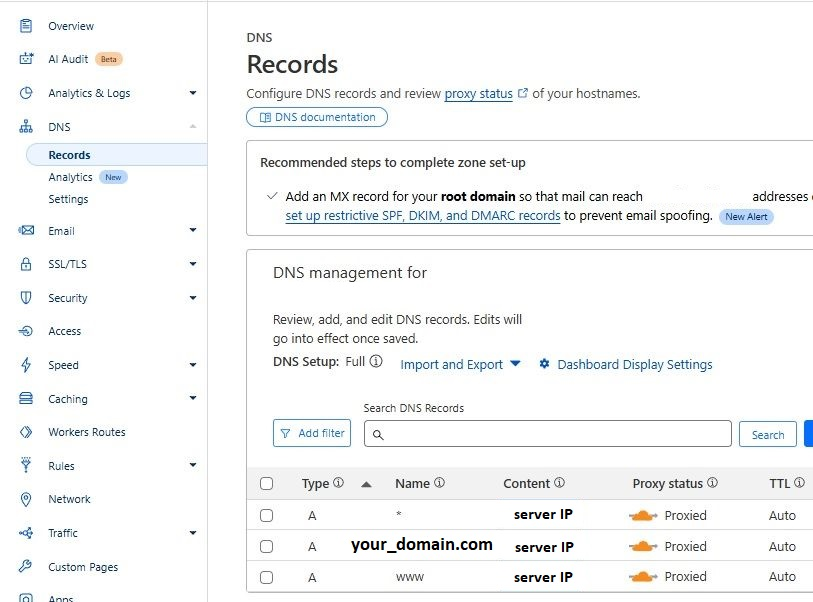

**#13.1 IF you use CloudFlare you need to enabe FULL SSL encryption: ( otherwise it will cause ERR_TOO_MANY_REDIRECTS )**
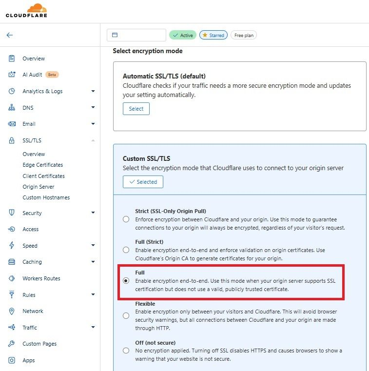


**#14 Install certbot to use Let's Encrypt free SSL certificates:**
```bash
sudo apt install certbot python3-certbot-nginx
```

**#15 Execute this command to create and install SSL for YOUR_DOMAIN:**
```bash
sudo certbot --nginx -d YOUR_DOMAIN
```


**#16 Install latest version of Node.js**
[Commands from "Install Node.js documentation"](https://nodejs.org/en/download/package-manager)
```bash
curl -o- https://raw.githubusercontent.com/nvm-sh/nvm/v0.40.3/install.sh | bash
```

```bash
source ~/.bashrc
```

```bash
nvm list-remote
```

**#17 Find the latest LTS version of the node available and install it using command like this:**
```bash
nvm install v22.11.0
```

##### verify the right Node.js version is in the environment
```bash
node -v
```
###### should print:
`v22.11.0`

#####  verify the right npm version is in the environment
```bash
npm -v
```
###### should print 
`10.9.0`

**#18 Install PM2 (the process manager for Node.js applications).**
PM2 basically manages applications (run them in the background as a service). 
So this is how we install PM2 globally:
```bash
npm install -g pm2
```

**#19 navigate your terminal to your current project directory:**
```bash
cd PROJECT_DIRECTORY
```

**#20.0 IF you cloning existing project then place files in current directory and run command:**
```bash
npm install
```
it will install all the Node.js related dependencies.

**#20.1 IF you're starting a new project then you can install Next.js starter project using command:**
```bash
npx create-next-app@latest ./
```
./ means that we create this Next.js project inside our current directory

**#21 Before creating pm2 daemon we need to have a build of our project, otherwise it will cause an error:**
```bash
log
[Error: ENOENT: no such file or directory, open '/var/www/YOUR_DOMAIN/html/.next/BUILD_ID'] {
errno: -2,
code: 'ENOENT',
syscall: 'open',
path: '/var/www/YOUR_DOMAIN/html/.next/BUILD_ID'
}
```

**#22 create the latest build for your project:**
```bash
npm run build
```

**#23 create ecosystem.config.js file at the root of the Node.js project, this is the config to run app via pm2. File will contain these code: (replace CURRENT_PROJECT with your current project name to properly show up at the pm2 status panel)**
```bash
module.exports = {
apps : [{
  name: "CURRENT_PROJECT",
  script: "npm",
  args: "start",
  cwd: "./",
  watch: true,
  watch_delay: 2000,
  // watch_options: {
  //   usePolling: true,
  //   // interval: 2000,
  // },
  env: {
    NODE_ENV: "production",
    PORT:3000,
  }
}]
};
```

**#24 run command to start process manager if you've created ecosystem.config.js file:**
```bash
pm2 start
```

**#25 run command to save process list so pm2:**
```bash
pm2 save
```

**#26 now you need to add pm2 to startup on system reboot - run ternimal command from below to get the final command which you will need to execute from sudo:**
```bash
pm2 startup systemd
```

**#27 copy the terminal output after the previous command execution and run that. The coomand will look similar to this:**
```bash
sudo env PATH=$PATH:/usr/bin pm2 startup systemd -u your_username --hp /home/your_username
```

**#28 now you need to save the process list again (important):**
```bash
pm2 save
```

**#OPTIONAL. IF you don't want to use config file then you can simply start your application using pm2 on port 3000**
```bash
pm2 start "npm run start -- -p 3000" --name YOU_APP_NAME
```


